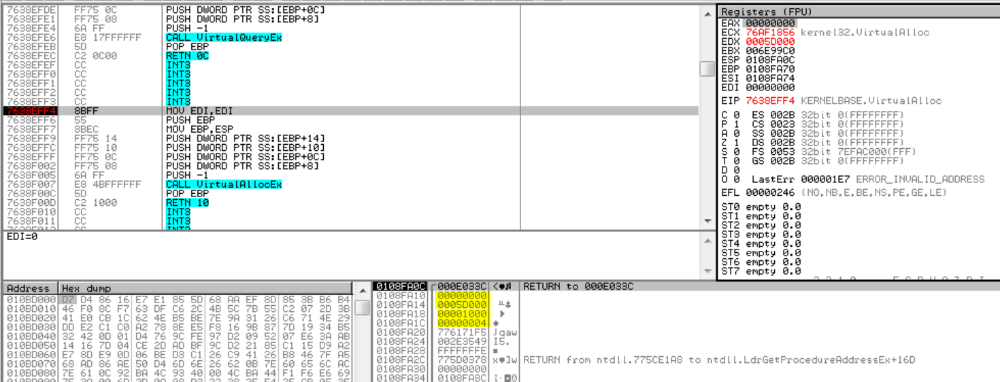
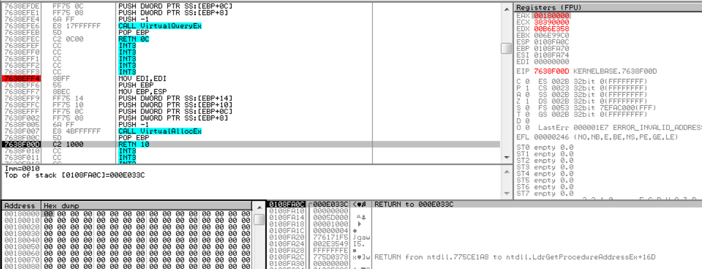
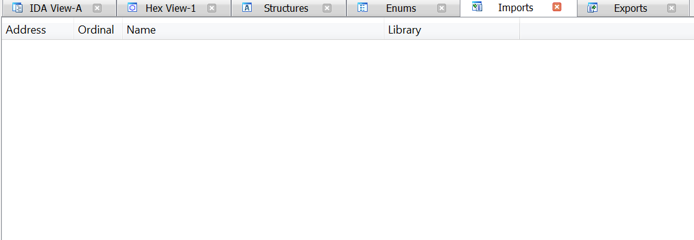
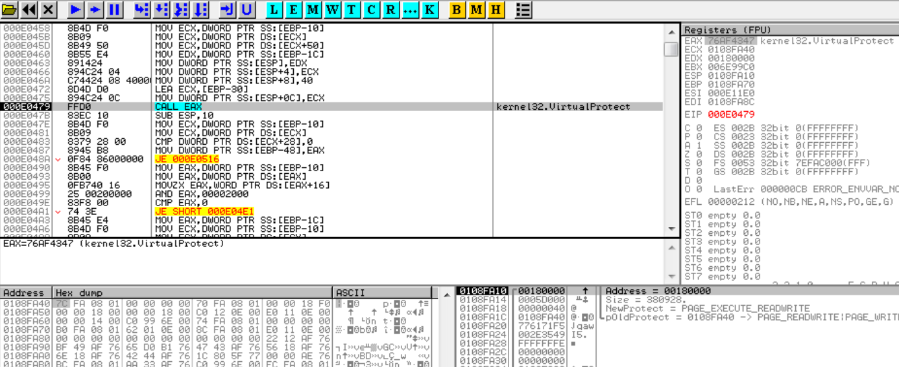
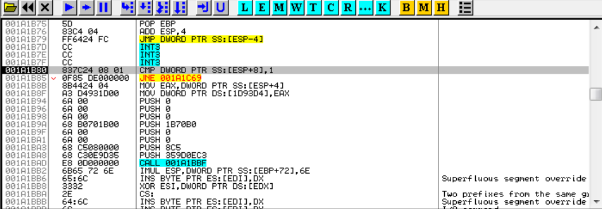
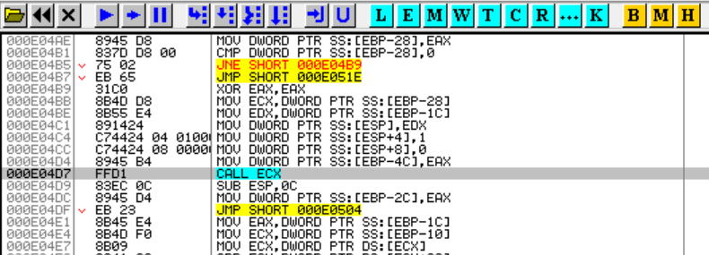

## Unpacking Malware Series - Maze Ransomware

In this occasion, I want to show you how I was capable of unpacking Maze ransomware. As I mentioned in [my](https://twitter.com/poxyran/status/1186311014926733313) tweet, getting a good dumped binary is a little bit tricky but with some patience you can do it.

## Tools

 - VMWare with an image of Windows 7
 - [Ollydbg 2.0.1](http://www.ollydbg.de/odbg201.zip)
 - [OllyDumpEx](http://low-priority.appspot.com/ollydumpex/) plugin for Ollydbg 2.x
 
## Unpacking process

Every time I have to deal with packed ransomware binaries I put breakpoints in some very common Windows API functions that this kind of malicious software use during the unpacking process. For instance, ransomware spawns processes using some of the **CreateProcess** family functions, decompress data using the **RtlDecompressBuffer** function, or change the permissions of the existing memory regions using **VirtualProtect**, among other things. The goal of using breakpoints in these common functions is to hit in the middle of the unpacking process and be able to work from there on. However, in this case, I found some troubles. 

The first trouble I had has to do with the debugger. I tried with *Ollydbg 1.10* and *x32dbg*. In the case of *Ollydbg*, it was crashing just by running the sample. Probably, this is because the *1.10* version was created long before *Windows 7* was released. The compatibility is not guaranteed. In the case of *x32dbg*, it was throwing a data misaligment exception repeatedly without stoping and I was unable to continue. As I wanted a quick solution and didn't have *Windbg* nor *IDA* installed on the VM, I decided to use a more recent version of *Ollydbg* that worked successfully with the samples. 

The second trouble I had was that none of my existing breakpoints were hitting. I had breakpoints in the following functions: CreateProcessA, CreateProcessInternalA, CreateProcessW, CreateProcessInternalW, VirtualProtect and RtlDecompressBuffer. However, there was still a function I tend to skip when unpacking malware becase it hits a lot of times: **VirtualAlloc**. Usually, ransomware use *VirtualAlloc* to create new regions to put stubs of code during the unpacking process. Sometimes, they create just a few virtual sections but in other cases they create a lot of new memory regions and that's mainly why I skip that function but, in this case, it was useful. 

The ransomware hits three times before creating a virtual section to store the ransomware core. The first time, it returns a valid memory region in *EAX*, the second time returns *NULL* and the third time is called it does it with the following parameters (as shown in the picture):

```
lpAddress = NULL
dwSize = 0x5D000
flAllocationType = MEM_COMMIT (0x00001000)
flProtect = PAGE_READWRITE
```


When returning from this call, we can see that the new memory region is committed:



Our region address is *0x180000*. 

If you let the ransomware run again, you'll see that this region is immediately filled with insteresting data:


A full **PE** image was written. Don't be so happy yet. If you dump this memory region, as I did it, you'll find out that there isn't any *IAT* and the string xrefs are broken:




I tried to fix the *IAT* using *IMPRec* and *ChipmREC* but both failed because of a call to *VirtualProtectEx* (I didn't dig further on that error). However, there was a problem with IAT and xrefs. This new memory region created by the ransomware is used as a new stub of code to continue with the attack and is outside the memory image we're debugging, even if you are able to dump the image, this new virtual region will not be dumped together with our image.

I decided to trace a little bit after the last *VirtualAlloc* breakpoint hit and found that a last call to *VirtualProtect* is done in order to give *PAGE_EXECUTE_READWRITE* permissions to this region and then the packer stub jumps to the new entry point:





We land in this new region because of a *CALL ECX*:



At this point, I used *OllyDumpEx* with the following options:


As you can see, I changed the base address to the one of the new memory region (*0x180000*) and then checked the **Auto Adjust Image Base Address** and **Rebuild DataDirectory (Follow ImageBase change)**.

Then, is just a matter of clicking in the **Dump** button and voilà (just don't pay attention to the waning given by *OllyDumpEx*):


You can see that the resulting binary has an *IAT* and string xrefs and we can continue our analysis from now on.

## Final words

As you can see, it wasn't so difficult to unpack this ransomware samples. It was just a matter of using the right tools and find the right place to dump it.

The last thing I want to say is that if you find any error on this post just let me know. Also, any feedback about how to improve the unpacking series is welcome. Don't hesitate to contact me.

See you soon!.


## Hashes

91514e6be3f581a77daa79e2a4905dcbdf6bdcc32ee0f713599a94d453a26fc1
6a22220c0fe5f578da11ce22945b63d93172b75452996defdc2ff48756bde6af
5c9b7224ffd2029b6ce7b82ea40d63b9d4e4f502169bc91de88b4ea577f52353