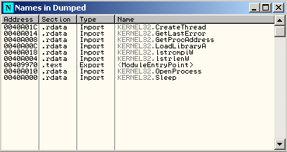
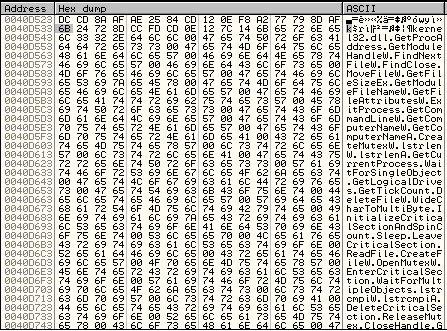
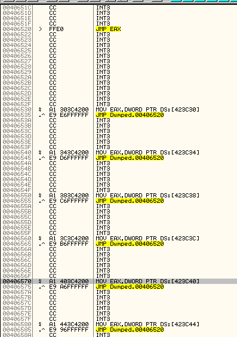

## Unpacking Malware Series - Fixing the (tiny) IAT redirection in Dharma ransomware

Very long time ago, like two years, I worte about [unpacking Dharma ransomware](https://crackinglandia.wordpress.com/2017/06/26/unpacking-malware-series-dharma-ransomware/ "Crackinglandia - Unpacking Dharma"). At that time, I put on my TODO list to write about the little IAT redirection the unpacked sample was implementing. Nothing hard or complex but I wanted to write about it, just for fun.

## Tools

In case you want to follow this analysis, you'll need the following tools:

 - VMWare with an image of Windows XP SP3/ Windows 7 (newer versions should work too)
 - Ollydbg
 - Ollyscript
 - The unpacked ransomware
 
## Studying the IAT redirection

Once you get the first layer removed, if you look at the import table functions, you'll see that there are just a few:



Tha's because most addresses of the important functions used by the ransomware are calculated dynamically. That's not new, you probably know the `LoadLibrary/GetProcAddress` combination, right?. If you trace a little bit the code, at some point, you'll find something like this code construction:

```
PUSH FUNCTION_PARAM
CALL TRAMPOLINE

TRAMPOLINE:
MOV EAX, DWORD PTR:DS[FUNC_ADDR]
JMP FIXED_JMP_EAX

FIXED_JMP_EAX:
JMP EAX
```

As you can see, the parameter for the function is pushed onto the stack and then a trampoline code is called instead of the real function. This little stub of code is in charge of getting the address of the imported function from a fixed address in the `.data` section and move it to the `EAX` register. Then, a `JMP EAX` instruction is executed to invoke the real function code. By doing this using these `trampolines`, the ransomware author adds some complexity to the code in order to avoid its analysis. Specially, the static analysis code because as we don't have the symbols of the functions there, we don't know for sure what the function calls go. This case if very easy to fix but keep in mind that it could be quite more complex.

The real `IAT` is built on a fixed region inside the `.data` section. The function in charge of doing this is `406440`:

```
00406440  /$  55            PUSH EBP
00406441  |.  8BEC          MOV EBP,ESP
00406443  |.  83EC 0C       SUB ESP,0C
00406446  |.  8B45 08       MOV EAX,DWORD PTR SS:[EBP+8]
00406449  |.  8945 F4       MOV DWORD PTR SS:[EBP-C],EAX
0040644C  |.  C745 F8 00000>MOV DWORD PTR SS:[EBP-8],0
00406453  |.  C745 FC 00000>MOV DWORD PTR SS:[EBP-4],0
0040645A  |>  8B4D F4       /MOV ECX,DWORD PTR SS:[EBP-C]
0040645D  |.  0FBE11        |MOVSX EDX,BYTE PTR DS:[ECX]
00406460  |.  85D2          |TEST EDX,EDX
00406462  |.  0F84 A7000000 |JE Dumped.0040650F
00406468  |.  8B45 F4       |MOV EAX,DWORD PTR SS:[EBP-C]
0040646B  |.  50            |PUSH EAX                                ; /FileName
0040646C  |.  FF15 0CA04000 |CALL DWORD PTR DS:[<&KERNEL32.LoadLibra>; \LoadLibraryA
00406472  |.  8945 FC       |MOV DWORD PTR SS:[EBP-4],EAX
00406475  |.  837D FC 00    |CMP DWORD PTR SS:[EBP-4],0
00406479  |.  0F84 89000000 |JE Dumped.00406508
0040647F  |>  8B4D F4       |/MOV ECX,DWORD PTR SS:[EBP-C]
00406482  |.  0FBE11        ||MOVSX EDX,BYTE PTR DS:[ECX]
00406485  |.  85D2          ||TEST EDX,EDX
00406487  |.  74 0B         ||JE SHORT Dumped.00406494
00406489  |.  8B45 F4       ||MOV EAX,DWORD PTR SS:[EBP-C]
0040648C  |.  83C0 01       ||ADD EAX,1
0040648F  |.  8945 F4       ||MOV DWORD PTR SS:[EBP-C],EAX
00406492  |.^ EB EB         |\JMP SHORT Dumped.0040647F
00406494  |>  8B4D F4       |MOV ECX,DWORD PTR SS:[EBP-C]
00406497  |.  83C1 01       |ADD ECX,1
0040649A  |.  894D F4       |MOV DWORD PTR SS:[EBP-C],ECX
0040649D  |>  8B55 F4       |/MOV EDX,DWORD PTR SS:[EBP-C]
004064A0  |.  0FBE02        ||MOVSX EAX,BYTE PTR DS:[EDX]
004064A3  |.  85C0          ||TEST EAX,EAX
004064A5  |.  74 41         ||JE SHORT Dumped.004064E8
004064A7  |.  8B4D F4       ||MOV ECX,DWORD PTR SS:[EBP-C]
004064AA  |.  51            ||PUSH ECX                               ; /ProcNameOrOrdinal = "SetHandleInformation"
004064AB  |.  8B55 FC       ||MOV EDX,DWORD PTR SS:[EBP-4]           ; |
004064AE  |.  52            ||PUSH EDX                               ; |hModule
004064AF  |.  FF15 08A04000 ||CALL DWORD PTR DS:[<&KERNEL32.GetProcA>; \GetProcAddress
004064B5  |.  8B4D F8       ||MOV ECX,DWORD PTR SS:[EBP-8]
004064B8  |.  89048D 303C42>||MOV DWORD PTR DS:[ECX*4+423C30],EAX
004064BF  |.  8B55 F8       ||MOV EDX,DWORD PTR SS:[EBP-8]
004064C2  |.  83C2 01       ||ADD EDX,1
004064C5  |.  8955 F8       ||MOV DWORD PTR SS:[EBP-8],EDX
004064C8  |>  8B45 F4       ||/MOV EAX,DWORD PTR SS:[EBP-C]
004064CB  |.  0FBE08        |||MOVSX ECX,BYTE PTR DS:[EAX]
004064CE  |.  85C9          |||TEST ECX,ECX
004064D0  |.  74 0B         |||JE SHORT Dumped.004064DD
004064D2  |.  8B55 F4       |||MOV EDX,DWORD PTR SS:[EBP-C]
004064D5  |.  83C2 01       |||ADD EDX,1
004064D8  |.  8955 F4       |||MOV DWORD PTR SS:[EBP-C],EDX
004064DB  |.^ EB EB         ||\JMP SHORT Dumped.004064C8
004064DD  |>  8B45 F4       ||MOV EAX,DWORD PTR SS:[EBP-C]
004064E0  |.  83C0 01       ||ADD EAX,1
004064E3  |.  8945 F4       ||MOV DWORD PTR SS:[EBP-C],EAX
004064E6  |.^ EB B5         |\JMP SHORT Dumped.0040649D
004064E8  |>  8B4D F4       |/MOV ECX,DWORD PTR SS:[EBP-C]
004064EB  |.  0FBE11        ||MOVSX EDX,BYTE PTR DS:[ECX]
004064EE  |.  85D2          ||TEST EDX,EDX
004064F0  |.  74 0B         ||JE SHORT Dumped.004064FD
004064F2  |.  8B45 F4       ||MOV EAX,DWORD PTR SS:[EBP-C]
004064F5  |.  83C0 01       ||ADD EAX,1
004064F8  |.  8945 F4       ||MOV DWORD PTR SS:[EBP-C],EAX
004064FB  |.^ EB EB         |\JMP SHORT Dumped.004064E8
004064FD  |>  8B4D F4       |MOV ECX,DWORD PTR SS:[EBP-C]
00406500  |.  83C1 01       |ADD ECX,1
00406503  |.  894D F4       |MOV DWORD PTR SS:[EBP-C],ECX
00406506  |.  EB 02         |JMP SHORT Dumped.0040650A
00406508  |>  EB 05         |JMP SHORT Dumped.0040650F
0040650A  |>^ E9 4BFFFFFF   \JMP Dumped.0040645A
0040650F  |>  8BE5          MOV ESP,EBP
00406511  |.  5D            POP EBP
00406512  \.  C3            RETN
```
This function just iterates over a list of strings stored at the beginning of the `.data` section with the libraries and function names to be loaded and calls `LoadLibrary` and `GetProcAddress`, respectively, in order to find the addresses of all the functions used by the ransomware. Then, it just fills the new IAT region with the values returned by `GetProcAddress`.

The following picture shows the strings of libraries/function names:



The following pictures shows the newly created `IAT`:


The address of the function that builds the new `IAT` can be found by simply finding one of the trampolines (by tracing the code) and putting a breakpoint on-write (hardware or memory breakpoint) on the address dereferenced in the `MOV EAX, DWORD PTR:DS[FUNC_ADDR]` instruction.

In the next section, you'll see how to fix this trampolines.

## Fixing the IAT redirection with Ollyscript

The following picture shows the place where all the trampolines reside:



As you can see, it starts with the `JMP EAX` and then you can see all the different trampolines. Each of them, correspond to a single Windows API call. Also, you can see that there is a kind of pattern for all this trampolines, right?. What would happen if we directly let the ransomware fill the new `IAT` and then replace all the trampolines with the real function call?. That's exactly what I did.

I'll put the code of my script, written in `Ollyscript` language and then I'll explain it:

```
var currentaddr

log "Starting rebuilding" 

doit:
find eip, #A1????????E9????????#
cmp $RESULT, 0
je endscript
mov currentaddr, $RESULT
cmp currentaddr, 406980
ja endscript

mov eax, [currentaddr+1]
mov [currentaddr], #FF25#
mov [currentaddr+2], eax
mov [currentaddr+6], #90909090#

add currentaddr, 0A
mov eip, currentaddr

jmp doit

endscript:
ret
``` 

